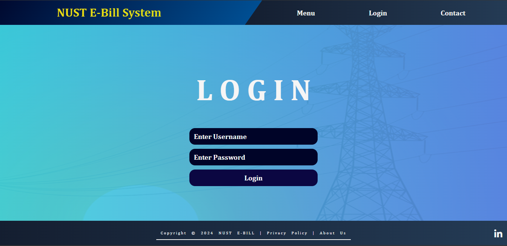

# ⚡ NUST E-Bill System

A full-stack **Electricity Billing System** developed using **HTML, CSS, JavaScript, Node.js, and SQL**. This web application is designed to manage electricity consumption and billing efficiently for both **residential** and **commercial** users. The system includes user and admin roles with separate access, dynamic billing based on usage, and integrated payment management.

---

## 🚀 Features

- 🔐 **User & Admin Authentication**
  - Secure login system for both users and administrators.
  - Role-based access control.

- 📊 **Dynamic Tariff-Based Billing**
  - Automatically calculates bills based on unit consumption and applicable tariff.

- 🧾 **Bill Generation & History**
  - Users can view, download, and track previous electricity bills.

- 🗄️ **Admin Dashboard**
  - View all users, their usage stats, and generated bills.
  - Add/update/delete user data.

- 🧱 **SQL Database Integration**
  - Stores user info, bill records, and authentication securely.

---

## 🛠️ Tech Stack

- **Frontend:** HTML, CSS, JavaScript  
- **Backend:** Node.js, Express.js  
- **Database:** MySQL / SQL  
- **Tools:** Postman, VSCode, MySQL, Git

---


---

## 🔧 Installation & Setup

1. **Clone the Repository**
   ```bash
   git clone https://github.com/MuhammadMahi585/NUST-E-bill-system.git
   cd NUST-E-bill-system

 


## Login Page

